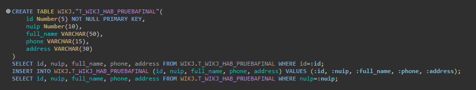
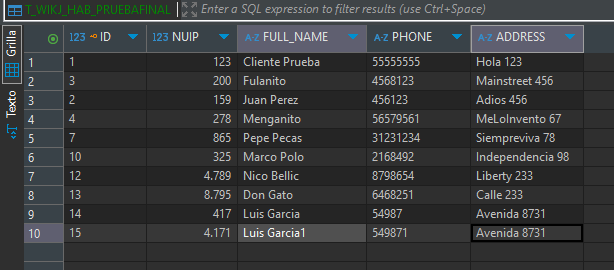
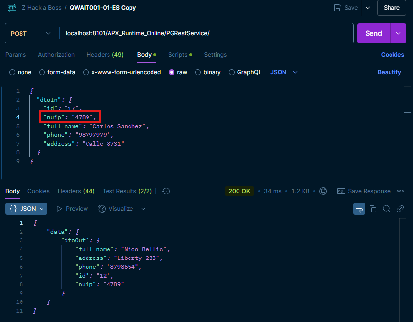
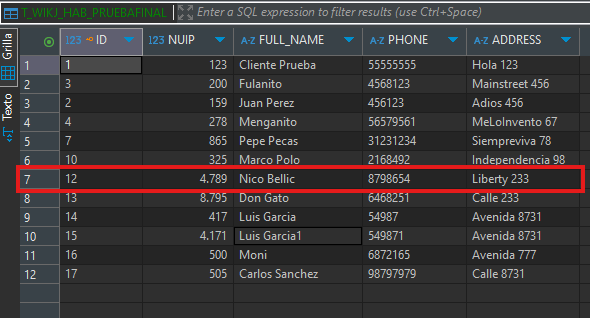
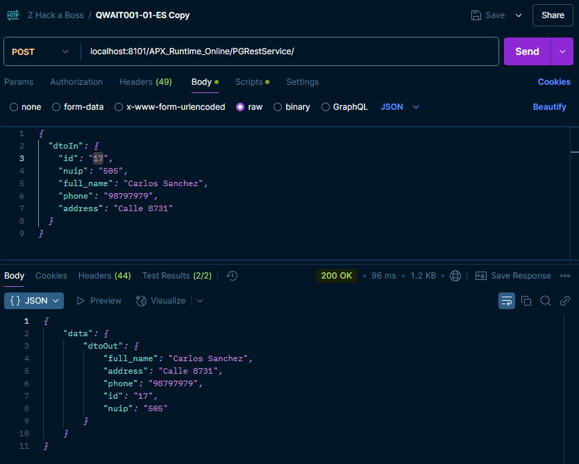
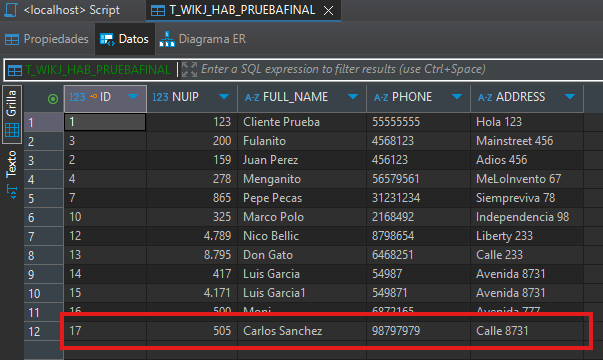

# DOCUMENTACION APX-SERVICE-PROJECT

## Introducción
En este documento se registran los datos que pueden ser relevantes durante el desarrollo del mismo, con la finalidad de dar apoyo en la comprensión de la toma de decisiones para el desarrollo de un servicio **APX**.

## Consideraciones
- El ejercicio está dividido en una librería de infraestructura y un proyecto general donde se desarrolla la lógica de negocio.
- Se basa en varios ejercicios realizados durante las clases.
 -Se utiliza apx-cli a través de terminales como cmd o PowerShell para minimizar errores.

## Tecnologías
- **Docker** para el levantamiento de un contenedor que permite el manejo del entorno local.
- **Postman** para el consumo de los servicios HTTP (POST).
- **IntelliJ IDEA** como entorno de desarrollo.
- **Plugin JetBrains AI Assistant** como apoyo para el desarrollo del servicio.
- **DBeaver** como gestor de bases de datos.

## Resultados
Se adjuntan imagenes de prueba de los resultados finales:

1. Las instrucciones SQL utilizadas para la creación y manipulación de las BDD en el desarrollo del proyecto.
   


3. Así queda construida la tabla en la BDD.
   
)

5. Al insertar un NUIP que ya está registrado, se devuelve la información del registro.
   
)

7. Los datos que ya estaban regstrados y que fueron llamados en Postman.
   
)

9. Al insertar un nuevo NUIP, se crea un nuevo registro.
    
)

11. Los datos del nuevo registro son llamados en Postman.
    
)


## Código

Metodo adicional para hacer un mapeo y evitar duplicación de código.
```
public DtoOut map(DtoOut dtoOut, Map<String, Object> in) {
		dtoOut.setId(in.get("id").toString());
		dtoOut.setNuip(in.get("nuip").toString());
		dtoOut.setFull_name(in.get("full_name").toString());
		dtoOut.setPhone(in.get("phone").toString());
		dtoOut.setAddress(in.get("address").toString());
		return dtoOut;
	}
```

Mapea los datos de entrada, en caso de enontrar un registro con un NUIP. trae la información para mostrarla; en caso contrario, se atrapa la excepción al devolver el objeto vacío y lo llena con los datos de entrada mapeados, para finalmente devolverlos en un objeto de salida.  
```
public DtoOut execute(DtoIn dtoIn) {
		DtoOut dtoOut = new DtoOut();
		Map<String, Object> args = new HashMap<>();

		args.put("id", dtoIn.getId());
		args.put("nuip", dtoIn.getNuip());
		args.put("full_name", dtoIn.getFull_name());
		args.put("phone", dtoIn.getPhone());
		args.put("address", dtoIn.getAddress());

		Map<String, Object> response = new HashMap<>();
		try {
			 response = this.wikjR889.executeSelect(dtoIn.getNuip());
		} catch (NoResultException e) {
			int result = this.wikjR889.executeInsert(args);
			response = this.wikjR889.executeSelect(dtoIn.getNuip());

				if (response != null && !response.isEmpty()) {
					map(dtoOut, response);
				}
		} finally {
			map(dtoOut, response);
		}

		return dtoOut;
	}
```

## Conclusión
Para la realización del proyecto se aplciaron los conocimientos y tecnologías que permitieron la realización del mismo, evitando un máximo posible de errores. Desde una perspectiva personal, se logro logró el objetivo nuevamente al condensar y aplicar lo aprendido para el desarrollo de este proyecto
